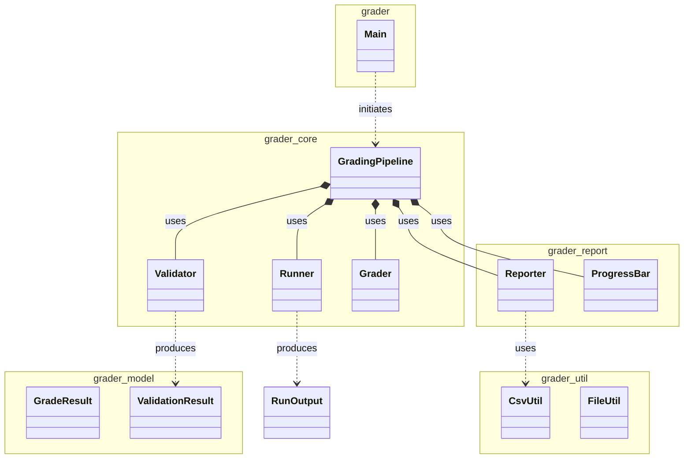
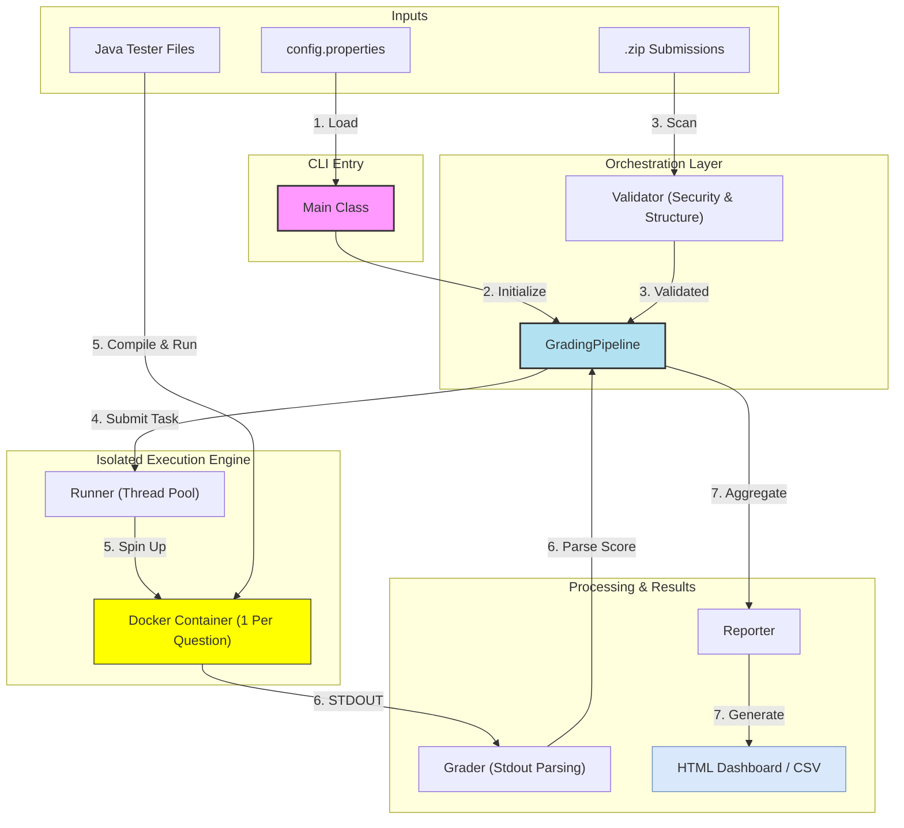

# OOP IS442 G3T3 — AutoGrader

A robust Java console application that auto-grades student ZIP submissions using Docker isolation and externalized configuration.

## System Architecture

### Class Diagram



### Core Classes

#### 1. `grader.Main`

- **Responsibility**: System entry point and CLI coordinator.
- **Functionality**:
  - Parses command-line arguments and switches between modes (`full` vs `--validate-only`).
  - Loads external `config.properties` into the system.
  - Orchestrates the initial handoff to the `grader.core.GradingPipeline`.

#### 2. `grader.core.GradingPipeline`

- **Responsibility**: The primary "brain" of the grading lifecycle.
- **Functionality**:
  - Manages the parallel execution flow using the `Runner`'s task submission API.
  - Aggregates multi-question scores into a single per-student result.
  - Handles batch command building and score collection.

#### 3. `grader.core.Runner`

- **Responsibility**: Secure execution environment manager (Docker).
- **Functionality**:
  - Manages a fixed thread pool for concurrent container execution.
  - Encapsulates Docker interaction, applying memory/CPU limits and strict timeouts.
  - Ensures automatic container cleanup after each run.

#### 4. `grader.core.Validator`

- **Responsibility**: Quality gate for student submissions.
- **Functionality**:
  - **Dynamic Requirement Detection**: Scans the project template folder to determine required files.
  - Detects common submission errors like double-nested folders or missing headers.
  - Implements heuristics to identify student identity within source files.

#### 5. `grader.util.FileUtil` & `grader.util.CsvUtil`

- **Responsibility**: Filesystem and data utility operations.
- **Functionality**:
  - `FileUtil`: Integrated native Java `ZipInputStream` for robust extraction; recursive root discovery.
  - `CsvUtil`: Specialized row mapping for the IS442 ScoreSheet CSV format.

#### 6. `grader.core.Grader` & `grader.report.Reporter`

- **Responsibility**: Result interpretation and output.
- **Functionality**:
  - `Grader`: Analyzes raw STDOUT to extract numeric scores using robust parsing.
  - `Reporter`: Generates a modern HTML dashboard and graduate-ready CSV results.
  - `ProgressBar`: Provides real-time CLI feedback during the grading lifecycle.

### Execution Flow

The system uses **one container per question** execution to isolate timeouts and prevent a single hanging test from blocking other questions.



#### Step-by-Step Breakdown

1.  **Configuration Loading**: `Main` loads `config.properties` and parses CLI arguments (paths, modes).
2.  **Pipeline Initialization**: The `GradingPipeline` is instantiated with paths and system settings.
3.  **Submission Validation**: Zip files are scanned for structural health and security (Zip-Slip protection).
4.  **Parallel Students Processing**: Valid submissions are submitted to the `Runner`'s thread pool.
    - Up to **5 students** are graded concurrently.
    - Each student task runs: `unzip` -> `setup testers` -> `docker run`.
5.  **Per-Question Execution**:
    - A Docker container is spun up per question to isolate timeouts and infinite loops.
    - Each question compiles and runs inside its own folder to avoid class collisions.
6.  **Score Extraction**: Each run’s output is parsed directly (no BEGIN/END tags needed).
7.  **Final Reporting**: Scores are aggregated into `GradeResult` objects and presented in a html report (`results/report.html`) alongside the gradebook-ready `results/results.csv`.

## Internal Optimizations

### 1. Isolated Per-Question Execution

To prioritize robustness and fairness, the system runs one Docker container per question. This isolates infinite loops/timeouts to a single question so other questions still receive scores.

### 2. Per-Question Compilation

Each question is compiled in its own folder (`cd <folder> && javac *.java`) to prevent class name collisions across questions.

### 3. Direct Output Parsing

Each tester run produces its own output, which is parsed directly by the `Grader` without BEGIN/END markers.

## Project Structure

```
src/
  grader/
    Main.java              CLI Entry Point
    core/
      GradingPipeline.java Primary Orchestrator
      Runner.java          Docker Execution Engine
      Validator.java       Submission Quality Gate
      Grader.java          Score Parsing Logic
    model/
      GradeResult.java     Score Data Model
      ValidationResult.java Submission Health Model
    report/
      Reporter.java        HTML & CSV Reporting
      ProgressBar.java     CLI Progress Feedback
    util/
      FileUtil.java        Filesystem Utils
      CsvUtil.java         CSV Parsing Utils
tests/
  grader/
    test/
      IntegrationTest.java E2E Pipeline Test
      GraderTest.java      Score Parsing Tests
      TestUtils.java       Assert Helpers
results/                   Generated Outputs
config.properties          System Configuration
RenameToYourUsername/      Project Template
scripts/                   Build & Run Automation
```

## Configuration (`config.properties`)

The system is fully configurable via `config.properties`.

| Key                      | Description                                  | Default                       |
| ------------------------ | -------------------------------------------- | ----------------------------- |
| `questions`              | Semicolon-separated folder:question mappings | `Q1:Q1a,Q1b;Q2:Q2a,Q2b;Q3:Q3` |
| `path.template`          | Folder used for dynamic validation           | `RenameToYourUsername`        |
| `runner.threads`         | Max concurrent Docker containers (limit 5)   | `5`                           |
| `runner.memory`          | Memory limit per container                   | `512m`                        |
| `runner.cpus`            | CPU limit per container                      | `1.0`                         |
| `runner.timeout_seconds` | Execution timeout per student                | `15`                          |
| `dir.testers`            | Folder containing Tester-Files               | `Tester-Files`                |
| `dir.work`               | Working directory for extractions            | `work`                        |

## 🚀 CLI Usage

### Commands

| Command               | Description                                                      |
| :-------------------- | :--------------------------------------------------------------- |
| `scripts\compile.bat` | Compiles all Java source files into the `out/` directory.        |
| `scripts\run.bat`     | Executes the autograder with the specified arguments.            |
| `scripts\test.bat`    | Executes the complete test suite (Unit Tests + E2E Integration). |

### Options & Flags

| Flag                   | Description                                                               | Default                |
| :--------------------- | :------------------------------------------------------------------------ | :--------------------- |
| `--submissions <path>` | **Required.** Path to the directory containing student ZIP files.         | N/A                    |
| `--validate-only`      | Performs structural validation only (scans ZIPs, skips Docker execution). | `false`                |
| `--testers <path>`     | Path to the directory containing `.java` tester files.                    | `Tester-Files`         |
| `--scoresheet <path>`  | Path to the IS442 ScoreSheet CSV template.                                | `scoresheet.csv`       |
| `--output <path>`      | Filename for merged CSV (written under `results/`).                       | `results/results.csv`  |
| `--workdir <path>`     | Directory used for temporary ZIP extraction and compilation.              | `work`                 |
| `--template <path>`    | Template folder used for dynamic file requirement detection.              | `RenameToYourUsername` |

## 🛠️ Getting Started

### Prerequisites

- **JDK 17+**
- **Docker Desktop** (Engine must be running)

### Quick Start

1. **Build and Test**

   ```bash
   # Windows
   scripts\compile.bat
   scripts\test.bat
   ```

2. **Run Standard Grading**

   ```bash
   scripts\run.bat --submissions student-submission
   ```

3. **Run Validation Only**
   ```bash
   scripts\run.bat --validate-only --submissions student-submission
   ```

> [!TIP]
> After execution, open **`results/report.html`** in your browser to view the generated dashboard, which includes a Bell Curve Distribution and student-specific feedback.
