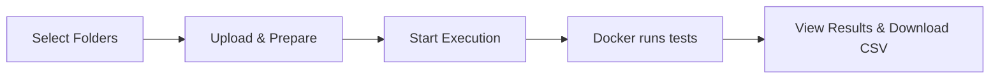
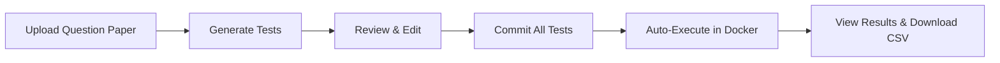
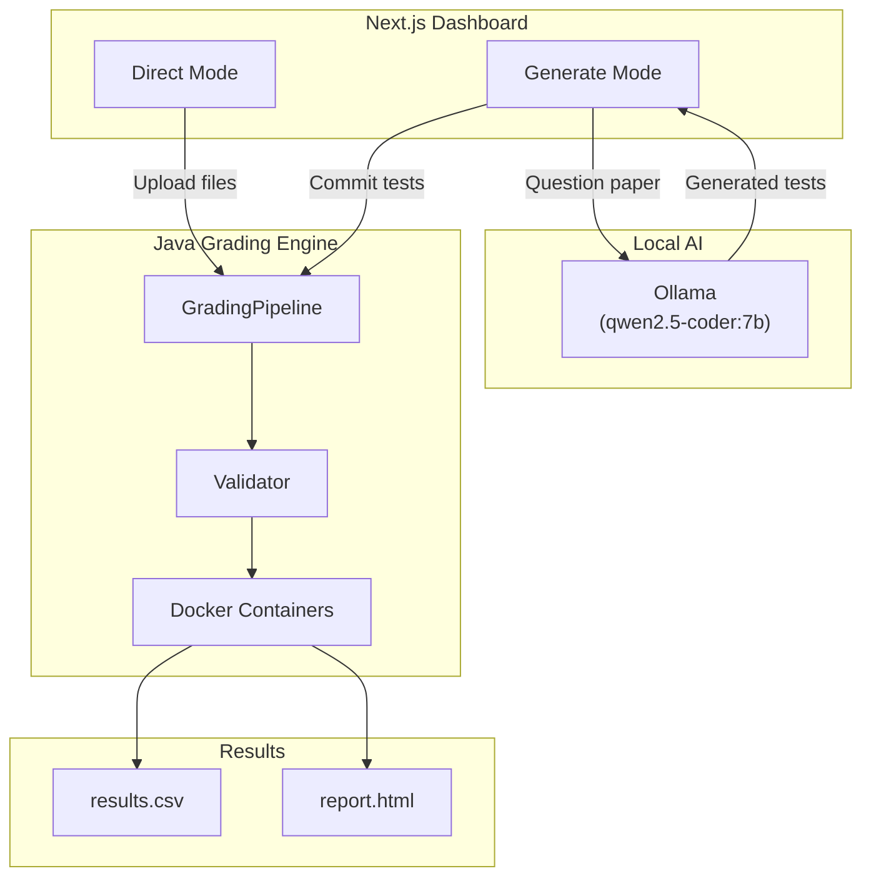

# 🎓 OOP IS442 G3T3 — AutoGrader

A Java-based auto-grader for IS442 student submissions. Each test runs in an **isolated Docker container**, producing per-question scores and a gradebook-ready CSV. Instructors interact via the **Next.js Dashboard** which supports two modes:

| Mode | Purpose |
|------|---------|
| **Direct** | You already have tester files — upload everything and grade immediately |
| **Generate** | You only have the question paper — AI generates the tester files for you |

---

## 🛠 Prerequisites

| Tool | Why it's needed |
|------|----------------|
| **☕ JDK 17+** | Compiles and runs the Java grading engine |
| **🐳 Docker Desktop** | Runs each student's code in an isolated container |
| **📦 Node.js 18+** & **pnpm** | Runs the Next.js dashboard |
| **🤖 Ollama** | Local AI engine for the Generate mode |

### Installing Ollama

**macOS:**
```bash
brew install ollama
brew services start ollama
```

**Windows:**
```bash
winget install Ollama.Ollama
```
After installation, **launch the Ollama app** from the Start Menu (it runs as a system tray icon and starts the server automatically on `http://localhost:11434`).

**Linux:**
```bash
curl -fsSL https://ollama.com/install.sh | sh
sudo systemctl start ollama
```

After Ollama is running, pull the required model:

```bash
ollama pull qwen2.5-coder:7b
```

> To verify Ollama is running: open `http://localhost:11434` in your browser — you should see `"Ollama is running"`.

> 💡 **Note:** Ollama is only required for **Generate mode**. If you are only using **Direct mode** (with your own tester files), you can skip this step.

---

## 🚀 Quick Start

### 1. Compile the Java grading engine

```bash
# macOS / Linux
./scripts/compile.sh

# Windows (Command Prompt)
scripts\compile.bat
```

### 2. Install dashboard dependencies

```bash
cd dashboard
pnpm install
```

> 💡 **Don't have pnpm?** Install it first: `npm install -g pnpm`

### 3. Ensure required services are running

| Service | How to start |
|---------|-------------|
| **Docker Desktop** | Open Docker Desktop from your Applications (macOS) or Start Menu (Windows) |
| **Ollama** _(Generate mode only)_ | **macOS:** `brew services start ollama` · **Windows:** Launch the Ollama app from Start Menu · **Linux:** `sudo systemctl start ollama` |

### 4. Start the dashboard

```bash
pnpm dev
```

Open [http://localhost:3000](http://localhost:3000) in your browser.

> ⚠️ **IMPORTANT:** Docker Desktop must be running before you start grading. Ollama must be running if you want to use Generate mode.

---

## 📤 Mode 1: Direct (Bring Your Own Tests)

Use this mode when you **already have `*Tester.java` files** written and ready to go.

### What you need to prepare

| Upload slot | What to select | Example |
|---|---|---|
| **Submissions** | A folder containing student `.zip` files (one zip per student) | `submissions/alice.zip`, `bob.zip` |
| **Tester Files** | The folder containing your `*Tester.java` files | `Tester-Files/` → `Q1aTester.java`, `Q2aTester.java`, etc. |
| **Exam Template** | The `RenameToYourUsername/` folder with `Q1/`, `Q2/`, `Q3/` subfolders — this defines the expected submission structure | `RenameToYourUsername/Q1/Q1a.java`, etc. |

### Step-by-step workflow

1. On the dashboard, make sure **DIRECT** is selected (default)
2. Click each upload zone to select the corresponding folder
3. Click **Upload & Prepare** — files are uploaded to the server
4. Click **Start Execution** — the Java grader runs each submission in Docker
5. View the **results table** with per-question scores and validation status
6. Click **Download CSV** to export the gradebook



---

## 🧬 Mode 2: Generate (AI-Assisted Test Creation)

Use this mode when you **don't have tester files yet** — the local AI model reads your question paper and generates them for you.

### What you need to prepare

| Upload slot | What to select | Example |
|---|---|---|
| **Assignment** | The question paper as a PDF, `.txt`, or `.md` file | `IS442_Final_2025.pdf` |
| **Exam Template** | Same `RenameToYourUsername/` folder as Direct mode | `RenameToYourUsername/Q1/Q1a.java`, etc. |

### Step-by-step workflow

1. Switch to **GENERATE** mode using the toggle
2. Upload or paste your question paper
3. Select the exam template folder
4. Click **Generate Tests** — Ollama (Qwen 2.5-coder) generates Java tester files in real time
5. **Review the generated tests** in the built-in code editor — edit if needed
6. Click **Commit All Tests** — tests are saved to `Tester-Files/` and the app transitions to execution
7. The grader runs automatically using the committed tests
8. View results and download CSV
9. _(Optional)_ Click **Download All Test Files (.ZIP)** to save the generated test suite



> ⚠️ **Generation time:** Test generation takes approximately **5 minutes** depending on your hardware, as all AI inference runs locally on your machine.

> 💡 **Recommendation:** AI-generated test cases may not perfectly match the exam's mark allocation. It is strongly recommended to **download the generated test files** and **manually review/edit** them before using for final grading. The number of test cases per question may differ from the intended marks.

> 💡 **How it works:** The dashboard sends your question paper and template structure to a locally-running Qwen 2.5-coder model via Ollama. The AI generates `*Tester.java` files that extend the student template classes, each with a `grade()` method that returns a score. All AI inference runs **locally** — nothing is sent to external APIs.

---

## 📂 Project Structure

```
autograder/
├── dashboard/               # Next.js web interface
│   ├── src/app/             #   Pages and API routes
│   ├── src/components/      #   UI components (UploadZone, TestReviewer, etc.)
│   └── src/lib/             #   Ollama client, logger, schemas
├── src/grader/              # Core Java grading engine
│   ├── Main.java            #   CLI entry point
│   ├── core/                #   GradingPipeline, Runner, Validator, Grader
│   ├── model/               #   Data models (GradeResult, ValidationResult)
│   ├── report/              #   HTML & CSV report generation
│   └── util/                #   File and CSV utilities
├── scripts/                 # Build and run scripts (cross-platform)
├── config.properties        # Grading engine configuration
├── Tester-Files/            # Java tester files (generated or manual)
├── RenameToYourUsername/     # Exam template folder structure
├── results/                 # Output: results.csv and report.html
└── web-uploads/             # Temp storage for dashboard uploads
```

---

## ⚙️ Configuration

Grading engine limits are controlled via [`config.properties`](config.properties):

| Key | Description | Default |
|-----|-------------|---------|
| `runner.threads` | Max concurrent Docker containers | `10` |
| `runner.memory` | Memory limit per container | `256m` |
| `runner.cpus` | CPU limit per container | `0.5` |
| `runner.timeout_seconds` | Max execution time per student (seconds) | `15` |
| `dir.testers` | Tester files directory | `Tester-Files` |
| `dir.work` | Temp working directory for extractions | `work` |

---

## 🏗 System Overview



---

## 🔧 Troubleshooting

| Problem | Solution |
|---------|----------|
| `Module not found: sonner` | Run `pnpm add sonner` in the `dashboard/` directory |
| Docker errors during grading | Ensure Docker Desktop is running (`docker info` to verify) |
| Ollama connection refused | **macOS:** `brew services start ollama` · **Windows:** Launch the Ollama app from the Start Menu (system tray) · **Linux:** `sudo systemctl start ollama` · **Manual (any OS):** `ollama serve` |
| Model not found | Run `ollama pull qwen2.5-coder:7b` |
| Java compilation fails | Ensure JDK 17+ is installed: `java -version` |
| `pnpm: command not found` | Install pnpm: `npm install -g pnpm` |
| Port 3000 already in use | **macOS/Linux:** `lsof -ti:3000 \| xargs kill` · **Windows:** `netstat -ano \| findstr :3000` then `taskkill /PID <pid> /F` |

---

## 📖 Further Documentation

- **[Dashboard README](dashboard/README.md)** — API routes, architecture diagram, and component details
- **[Grader README](src/grader/README.md)** — CLI usage, class diagram, and execution flow
