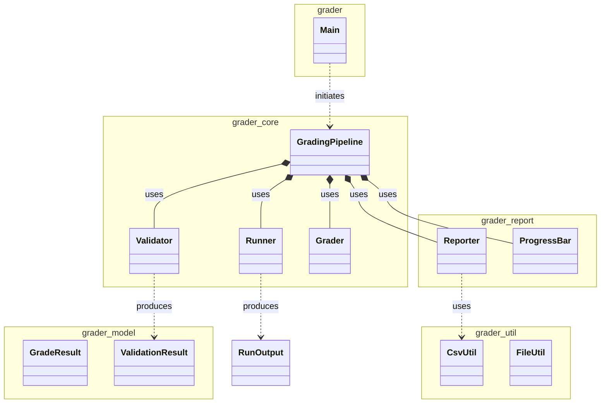
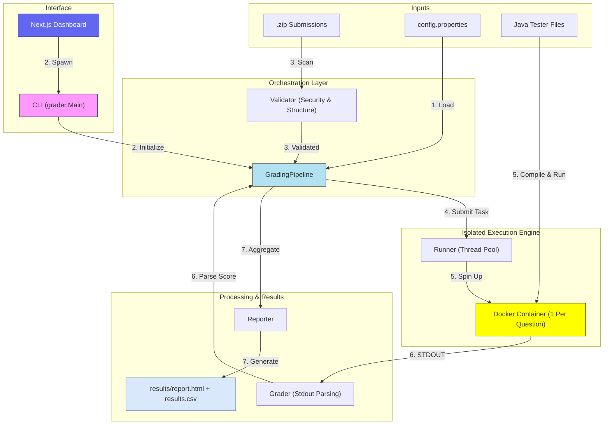

# OOP IS442 G3T3 — AutoGrader

A Java-based auto-grader for IS442 student submissions. Runs each test in an isolated Docker container and produces per-question scores and a gradebook-ready CSV. Instructors can interact via the **Next.js dashboard** (recommended) or the **CLI** directly.

---

## Prerequisites

- **JDK 17+**
- **Docker Desktop** (engine must be running)
- **Node.js 18+** and **pnpm** — for the dashboard only

---

## Option 1: Dashboard (Recommended)

A web UI with two modes:

- **Direct** — upload student submission zips, tester files folder, and exam template folder. Grade immediately.
- **Generate** — upload the question paper (PDF or text) and the template folder; the AI generates JUnit test files for you to review before grading.

### Setup

```sh
# 1. Compile the Java grader
./scripts/compile.sh        # macOS/Linux
scripts\compile.bat         # Windows

# 2. Install dashboard dependencies
cd dashboard
pnpm install

# 3. Start the dashboard
pnpm dev
```

Then open [http://localhost:3000](http://localhost:3000).

> Docker must be running before you click **Start Execution** in the dashboard.

### Dashboard workflow (Direct mode)

1. Select student `.zip` files (one per student)
2. Select the `Tester-Files` folder containing `*Tester.java` files
3. Select the `RenameToYourUsername` template folder
4. Click **Upload & Prepare**, then **Start Execution**
5. View per-question scores, validation status, and download the results CSV

### Dashboard workflow (Generate mode)

1. Paste or upload the question paper (PDF / `.txt` / `.md`)
2. Select the `RenameToYourUsername` template folder
3. Click **Start Autograder** — AI generates JUnit test files
4. Review and approve the generated tests
5. Click **Start Execution**
6. View results and download CSV

---

## Option 2: CLI

For scripted or headless environments.

### Build

```sh
./scripts/compile.sh        # macOS/Linux
scripts\compile.bat         # Windows
```

### Run

```sh
# macOS/Linux
./scripts/run.sh --submissions <path-to-zip-folder>

# Windows
scripts\run.bat --submissions <path-to-zip-folder>
```

### CLI flags

| Flag | Description | Default |
|---|---|---|
| `--submissions <path>` | **Required.** Directory containing student `.zip` files | — |
| `--testers <path>` | Directory containing `*Tester.java` files | `Tester-Files` |
| `--template <path>` | Template folder for structural validation | `RenameToYourUsername` |
| `--scoresheet <path>` | IS442 ScoreSheet CSV template | `scoresheet.csv` |
| `--output <path>` | Output CSV path | `results/results.csv` |
| `--workdir <path>` | Temp directory for extraction and compilation | `work` |
| `--validate-only` | Validate structure only, skip Docker execution | `false` |

### Other scripts

| Script | Description |
|---|---|
| `scripts/compile` | Compile all Java source files into `out/` |
| `scripts/test` | Run unit tests and E2E integration tests |

---

## Project Structure

```
src/grader/
  Main.java                  CLI entry point
  core/
    GradingPipeline.java     Primary orchestrator
    Runner.java              Docker execution engine
    Validator.java           Submission quality gate
    Grader.java              Score parsing logic
  model/
    GradeResult.java         Score data model
    ValidationResult.java    Submission health model
  report/
    Reporter.java            HTML & CSV report generation
    ProgressBar.java         CLI progress feedback
  util/
    FileUtil.java            Filesystem utilities
    CsvUtil.java             CSV parsing utilities
dashboard/                   Next.js web UI
tests/                       Unit & integration tests
results/                     Generated outputs (HTML report, CSV)
RenameToYourUsername/        Exam template folder
Tester-Files/                Tester Java files
config.properties            System configuration
```

---

## Configuration (`config.properties`)

| Key | Description | Default |
|---|---|---|
| `runner.threads` | Max concurrent Docker containers | `5` |
| `runner.memory` | Memory limit per container | `512m` |
| `runner.cpus` | CPU limit per container | `1.0` |
| `runner.timeout_seconds` | Execution timeout per student (seconds) | `15` |
| `dir.testers` | Tester files directory | `Tester-Files` |
| `dir.work` | Working directory for extractions | `work` |

---

## System Architecture

### Class Diagram



### Execution Flow


