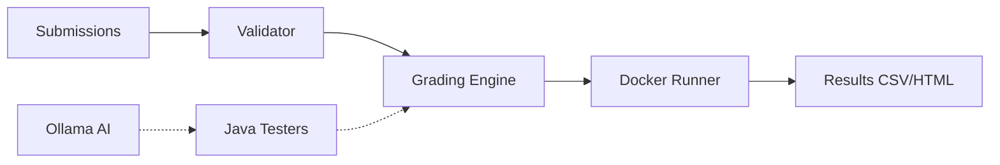

# 🎓 OOP IS442 G3T3 — AutoGrader

A Java-based auto-grader for IS442 student submissions. Runs each test in an isolated Docker container and produces per-question scores and a gradebook-ready CSV. Instructors can interact via the **Next.js dashboard** (recommended) or the **CLI** directly.

---

## 🛠 Prerequisites

- **☕ JDK 17+**
- **🐳 Docker Desktop** (engine must be running)
- **📦 Node.js 18+** and **pnpm**
- **🤖 Ollama** — with `qwen2.5-coder:3b` installed
```bash
# 1. Install ollama if not yet installed
# macOS
curl -fsSL https://ollama.com/install.sh | sh
# Windows
irm https://ollama.com/install.ps1 | iex

# 2. Pull the model
ollama pull qwen2.5-coder:3b
```

---

## 🚀 Option 1: Dashboard (Recommended)

A web UI with two modes:

- **📤 Direct** — upload student submission zips, tester files folder, and exam template folder. Grade immediately.
- **🧬 Generate** — upload the question paper (PDF or text) and the template folder and **Ollama** powered by **Qwen2.5-coder:3b** generates Java tester files for you to review, commit, and automatically execute.

### ⏱ Quick Start

```sh
# 1. Compile the Java grader
./scripts/compile.sh        # macOS/Linux
scripts\compile.bat         # Windows

# 2. Install dashboard dependencies
cd dashboard
pnpm install

# 3. Start the dashboard
pnpm dev
```

Then open [http://localhost:3000](http://localhost:3000).

> ⚠️ **IMPORTANT**: Docker must be running before you click **Start Execution** in the dashboard.

### Dashboard workflow (Direct mode)

1. Select student `.zip` files (one per student)
2. Select the `Tester-Files` folder containing `*Tester.java` files
3. Select the `RenameToYourUsername` template folder
4. Click **Upload & Prepare**, then **Start Execution**
5. View per-question scores, validation status, and download the results CSV

### Dashboard workflow (Generate mode)

1. Paste or upload the question paper (PDF / `.txt` / `.md`)
2. Select the `RenameToYourUsername` template folder
3. Click **Start Autograder** — Local AI generates Java tester files incrementally
4. Review the generated tests in the live editor
5. Click **Commit All Tests** — Tests are saved to `Tester-Files/` and the app auto-transitions to the execution stage
6. Click **Download All Test Files (.ZIP)** to bundle the suite for distribution (optional)
7. View results and download CSV

---

---

## 🚀 Getting Started

The recommended way to use the AutoGrader is via the **Next.js Dashboard**.

### ⏱ Quick Start

1. **Compile the Java Core**
   ```bash
   scripts\compile.bat  # Windows
   ./scripts/compile.sh # macOS/Linux
   ```

2. **Start the Dashboard**
   ```bash
   cd dashboard
   pnpm install
   pnpm dev
   ```

3. **Open the App**
   Navigate to [http://localhost:3000](http://localhost:3000).

---

## 📂 Project Organization

- **[dashboard/](dashboard/README.md)** — Next.js web interface for grading and AI test generation.
- **[src/grader/](src/grader/README.md)** — Core Java grading engine, CLI, and configuration details.
- **Tester-Files/** — Directory for Java JUnit tester files.
- **RenameToYourUsername/** — Folder structure for student submissions.

---

## ⚙️ Configuration

System-wide limits (threads, memory, timeouts) are managed in:
👉 **[config.properties](config.properties)**

*Detailed configuration documentation can be found in the [Grader README](src/grader/README.md#configuration-configproperties).*

---

## 🏗 System Overview

Below is a simplified view of the grading pipeline:



For the execution engine documentation, see the **[Technical Documentation](src/grader/README.md#system-architecture)**.

For the UI documentation, see the **[UI Documentation](dashboard/README.md)**.
