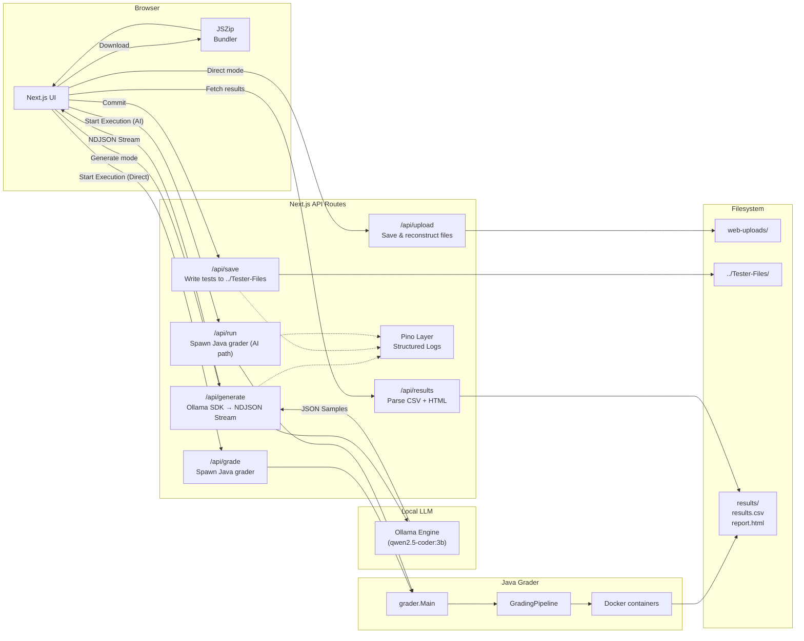
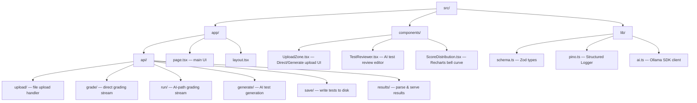

# 🎨 AutoGrader Dashboard

Next.js web UI for the IS442 AutoGrader. Provides two grading workflows and displays per-question results with score distribution charts.

---

## 📦 Prerequisites

- **Node.js 18+**
- **pnpm**
- **Ollama** installed locally (with `qwen2.5-coder:3b`)
- Java grader compiled (`../out/` must exist — run `scripts/compile` from the project root)
- **Docker Desktop** running (required when grading executes)

---

## 🚀 Setup

```sh
# Run dev server
pnpm install
pnpm dev

# Build for production
pnpm build
pnpm start
```

Open [http://localhost:3000](http://localhost:3000).

---

## 🔄 Workflows

### Direct mode (bring your own tests)

Upload three things, then grade:

| Input         | What to select                                                               |
| ------------- | ---------------------------------------------------------------------------- |
| Submissions   | Student `.zip` files (one per student)                                       |
| Tester Files  | The `Tester-Files/` folder containing `*Tester.java` files                   |
| Exam Template | The `RenameToYourUsername/` folder containing `Q1/`, `Q2/`, `Q3/` subfolders |

Click **Upload & Prepare**, then **Start Execution**.

### Generate mode (AI-assisted)

For when tester files don't exist yet:

1. Paste the question paper or upload a PDF / `.txt` / `.md`
2. Select the `RenameToYourUsername/` template folder
3. Click **Start Autograder** — Local Ollama generates Java tester files
4. Review and edit the generated tests in the editor
5. Click **Commit All Tests** — App saves tests to `../Tester-Files/` and jumps to execution
6. Click **Download All Test Files (.ZIP)** to get a bundled suite (uses JSZip client-side)

---



---

## 🌐 API Routes

| Route | Method | Description |
| --- | --- | --- |
| `/api/upload`   | POST   | Accepts multipart form data (`submissions`, `testers`, `template`), saves to `web-uploads/` |
| `/api/grade`    | POST   | Streams output from `grader.Main` using the `web-uploads/` directories                      |
| `/api/run`      | POST   | Streams output from `grader.Main` using the saved AI-generated tests                        |
| `/api/generate` | POST   | Streams NDJSON from local Ollama for incremental test generation                            |
| `/api/save`     | POST   | Writes approved test files to `../Tester-Files/` (recursive)                                |
| `/api/results`  | GET    | Reads `results/results.csv` and `results/report.html`, returns parsed JSON                  |

---

## 🔐 Environment Variables

Not currently required for Local AI mode. Ensure Ollama is running at `http://localhost:11434`.

---

## 📂 Project Structure


