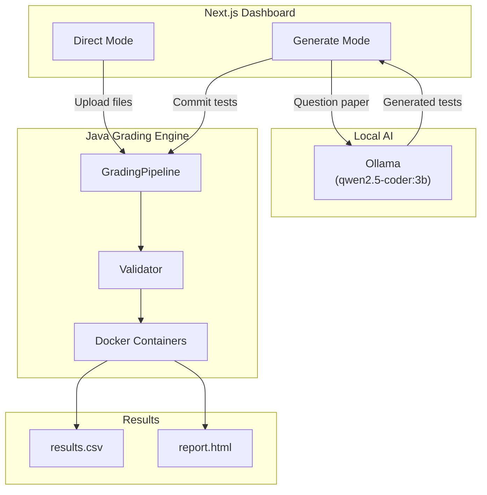
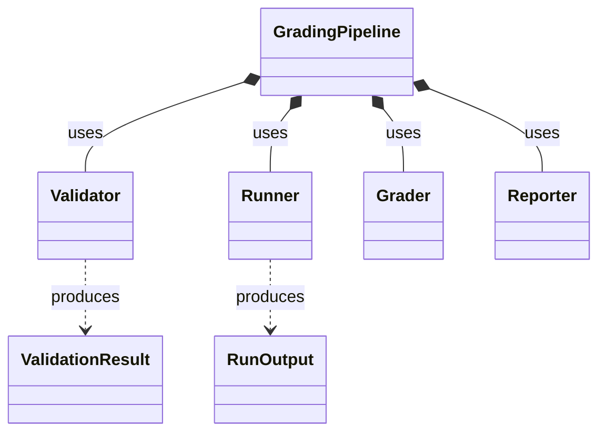

# 🏗 Architecture & Design

This document details the internal structure and flow of the AutoGrader system.

## 🏗 System Overview



---

## 📂 Project Structure

```
autograder/
├── dashboard/               # Next.js web interface
│   ├── src/app/             #   API routes & main pages
│   ├── src/components/      #   Modular UI components
│   └── src/lib/             #   Ollama client & utilities
├── src/grader/              # Core Java grading engine
│   ├── Main.java            #   CLI entry point
│   ├── core/                #   GradingPipeline, Runner, Validator
│   ├── model/               #   Data models (GradeResult)
│   └── report/              #   HTML & CSV generation
├── scripts/                 # Build/Run scripts
├── results/                 # Output: results.csv and report.html
├── Tester-Files/            # Java tester files
└── web-uploads/             # Dashboard temp storage
```

---

## 🌐 API Routes

| Route | Method | Description |
| --- | --- | --- |
| `/api/upload`   | POST   | Handles folder uploads to `web-uploads/` |
| `/api/grade`    | POST   | Streams Direct mode grading logs |
| `/api/run`      | POST   | Streams AI-path grading logs |
| `/api/generate` | POST   | Streams NDJSON from local Ollama |
| `/api/save`     | POST   | Writes tests to disk |
| `/api/results`  | GET    | Serves parsed JSON from results folder |

---

## ☕ Java Core Class Diagram


