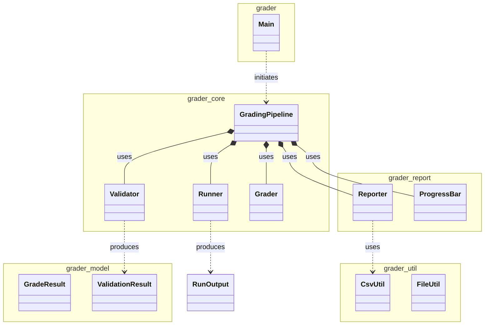
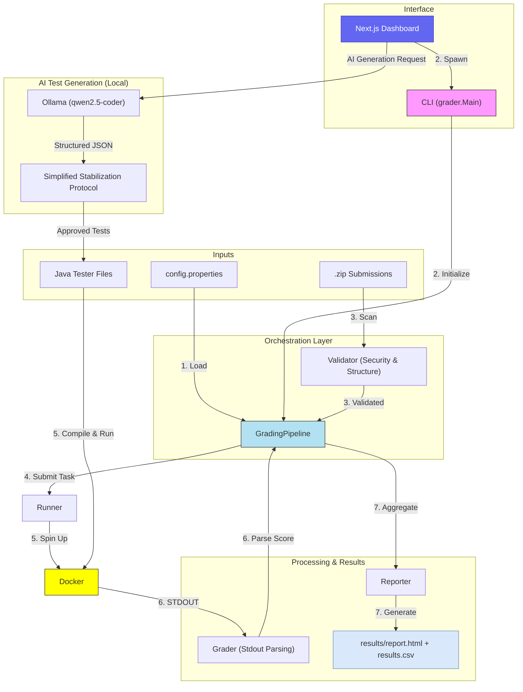

# ☕ AutoGrader Core (Java)

This directory contains the core Java logic for the AutoGrader. It handles submission validation, Docker-based test execution, and result report generation.

---

## 🛠 Prerequisites

- **JDK 17+**
- **Docker Desktop** (Engine must be running)

---

## 🚀 CLI Usage

For scripted or headless environments, you can interact with the core directly via the CLI.

### Build
```sh
./scripts/compile.sh        # macOS/Linux
scripts\compile.bat         # Windows
```

### Run
```sh
# macOS/Linux
./scripts/run.sh --submissions <path-to-zip-folder>

# Windows
scripts\run.bat --submissions <path-to-zip-folder>
```

### CLI Flags

| Flag | Description | Default |
|---|---|---|
| `--submissions <path>` | **Required.** Directory containing student `.zip` files | — |
| `--testers <path>` | Directory containing `*Tester.java` files | `Tester-Files` |
| `--template <path>` | Template folder for structural validation | `RenameToYourUsername` |
| `--output <path>` | Output CSV path | `results/results.csv` |
| `--workdir <path>` | Temp directory for extraction and compilation | `work` |
| `--validate-only` | Validate structure only, skip Docker execution | `false` |

---

## 📂 Project Structure

```
src/grader/
  Main.java                  CLI entry point
  core/
    GradingPipeline.java     Primary orchestrator
    Runner.java              Docker execution engine
    Validator.java           Submission quality gate
    Grader.java              Score parsing logic
  model/
    GradeResult.java         Score data model
    ValidationResult.java    Submission health model
  report/
    Reporter.java            HTML & CSV report generation
    ProgressBar.java         CLI progress feedback
  util/
    FileUtil.java            Filesystem utilities
    CsvUtil.java             CSV parsing utilities
```

---

## ⚙️ Configuration (`config.properties`)

The core execution engine is configured via the `config.properties` file in the project root.

| Key | Description | Default |
|---|---|---|
| `runner.threads` | Max concurrent Docker containers | `10` |
| `runner.memory` | Memory limit per container | `256m` |
| `runner.cpus` | CPU limit per container | `0.5` |
| `runner.timeout_seconds` | Execution timeout per student (seconds) | `15` |
| `dir.testers` | Tester files directory | `Tester-Files` |
| `dir.work` | Working directory for extractions | `work` |

---

## 🏗 System Architecture

### Class Diagram



### Execution Flow


